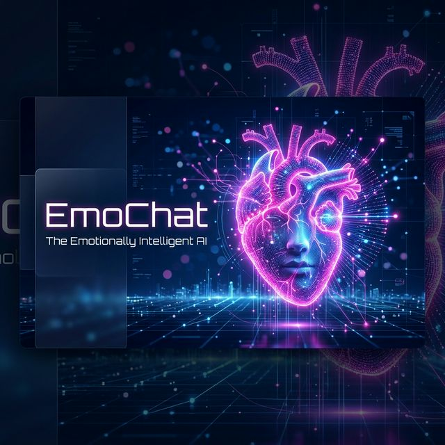
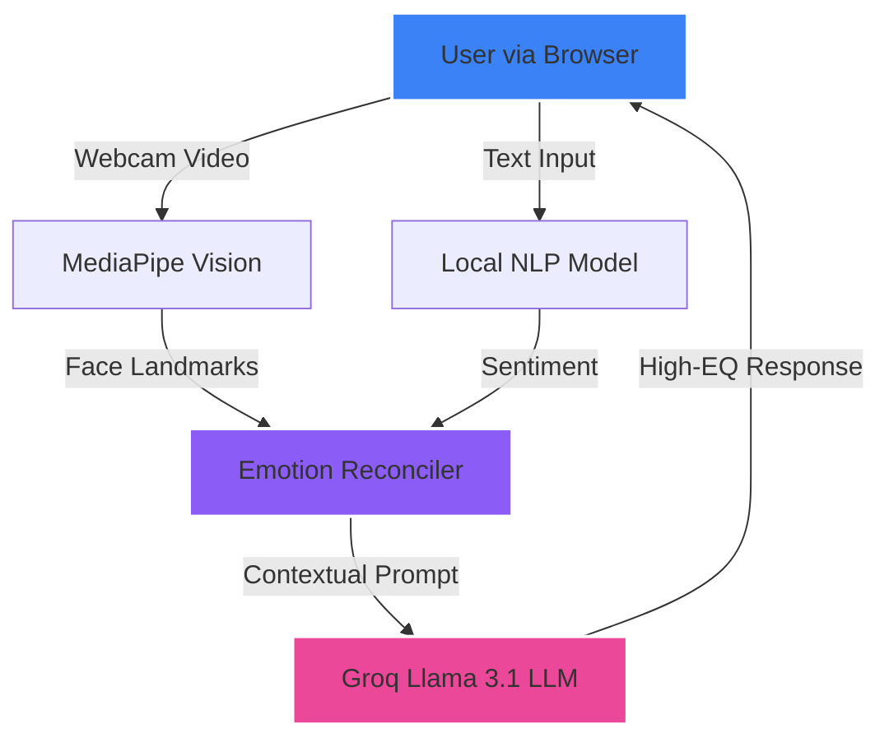

<div align="center">



# ✨ EmoChat - The Emotionally Intelligent AI ✨

[](https://groq.com)
[](https://react.dev)
[](https://fastapi.tiangolo.com)
[](https://mediapipe.dev)

**"Because conversations should feel as human as you are."**

[Explore Documentation](#-features) • [Quick Start](#-installation) • [Contributing](#-contribution)

---

</div>

## 🚀 The Vision
**EmoChat** isn't just another chat interface. It’s a multimodal companion that synchronizes with your emotional wavelength. By combining **High-Fidelity Facial Analysis (MediaPipe)** and **Real-time Sentiment Inference**, EmoChat listens not just to your words, but to your presence.

Powered by **Llama-3.1-8B-Instant** via **Groq Cloud**, the responses are ultra-low latency and remarkably human-like.

---

## 💎 Features at a Glance

### 👁️ Multimodal Sentiment
- **Vision-Sync**: Live analysis of facial landmarks to detect smiling, sadness, frustration, or alarm.
- **NLP Inference**: Local multinomial NB classifier + Groq LLM for deep text sentiment analysis.

### 🎭 Super Human Persona
- **"Emo" Personality**: A strikes-it-right balance of informal warmth and professional intelligence.
- **Adaptive Tones**: Response style shifts dynamically based on detected facial & text emotions.

### ⚡ Performance & Design
- **Groq Acceleration**: Lightning-fast inference on Llama-3.1.
- **Glassmorphic UI**: High-end dark mode aesthetics with smooth Framer Motion transitions.
- **Privacy-First**: Real-time analysis is local; only context is shared for the conversation!

---

## 🛠️ Architecture



---

## 📦 Installation & Setup

### 1️⃣ Clone the Repository
```bash
git clone https://github.com/BuildWithAni/emotion-chat.git
cd emotion-chat
```

### 2️⃣ Backend Configuration
Ensure you have Python 3.10+ installed.
```bash
cd backend
pip install -r requirements.txt
# Create a .env file and add your GROQ_API_KEY
python main.py
```

### 3️⃣ Frontend Configuration
Ensure you have Node.js 18+ installed.
```bash
cd frontend
npm install
npm run dev
```

---

## 🎨 Technology Stack

<table align="center">
  <tr>
    <td align="center"><b>Frontend</b></td>
    <td align="center"><b>Backend</b></td>
    <td align="center"><b>Intelligence</b></td>
  </tr>
  <tr>
    <td align="center">React 18 / Vite</td>
    <td align="center">FastAPI / Uvicorn</td>
    <td align="center">Groq / Llama 3.1</td>
  </tr>
  <tr>
    <td align="center">Tailwind CSS</td>
    <td align="center">MediaPipe</td>
    <td align="center">Scikit-Learn</td>
  </tr>
  <tr>
    <td align="center">Framer Motion</td>
    <td align="center">Python 3.10</td>
    <td align="center">NLP Pipeline</td>
  </tr>
</table>

---

## 🤝 Contribution
Contributions are what make the open source community such an amazing place to learn, inspire, and create. Any contributions you make are **greatly appreciated**.

1. Fork the Project
2. Create your Feature Branch (`git checkout -b feature/AmazingFeature`)
3. Commit your Changes (`git commit -m 'Add some AmazingFeature'`)
4. Push to the Branch (`git push origin feature/AmazingFeature`)
5. Open a Pull Request

---

<p align="center">Made with ❤️ by <b>BuildWithAni</b></p>
